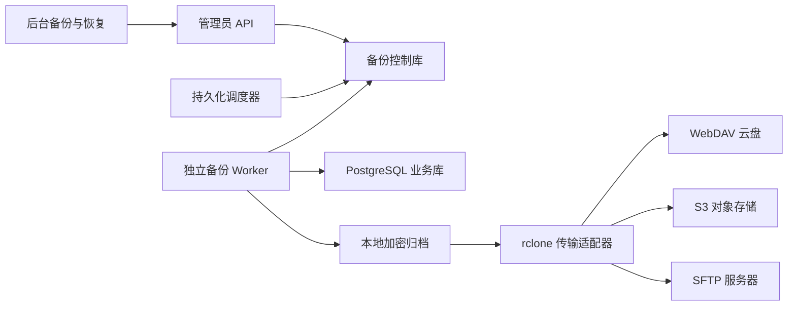

# 备份与版本回滚设计

日期：2026-10-08。状态：原始设计方案；本地与 SFTP 首版已落实，实际范围及部署要求见[落地说明](backup-and-restore-implementation-2026-10-08.md)。本文保留后续云盘、配置灾备包等扩展设计，不代表所有扩展已经实现。

## 1. 目标与首版范围

后台新增「备份与恢复」，完成本地备份、多目标远程副本、可配置自动备份、指定备份版本回滚、全过程日志。首版采用全量备份，每个版本可以独立恢复，不依赖其他版本。

用户已明确：本次先完成详细设计，远程存储优先 SFTP／SSH 服务器。

一个备份版本可以同时保存到本地、多个云盘和多个服务器。首期远程适配器实现 SFTP，WebDAV、S3 兼容存储按相同接口扩展；统一以 rclone 执行传输，应用掌握版本、调度、校验与恢复流程。WebDAV 可对接开放该协议的云盘及自建服务；SFTP 对接服务器；S3 对接对象存储。具体网盘能否接入取决于其开放协议或 rclone 后端，不宣称所有网盘都能直接连接。

SFTP 使用 SSH 加密传输，支持密码或私钥认证，不要求在远端运行数据库命令或部署知舟。建议创建只能访问指定备份目录的账号；后台不提供任意 SSH 命令执行。远端服务器保管副本，恢复仍由当前站点 Worker 执行。

后续再增加指定厂商的 OAuth、增量备份、连续 WAL 归档及时间点恢复。首版「版本回滚」指恢复某次备份，不是恢复任意秒，也不负责回滚应用代码。

## 2. 当前项目依据

| 当前实现 | 对备份设计的影响 |
| --- | --- |
| `api/src/db/pool.ts`：生产数据库是 PostgreSQL | 使用 PostgreSQL 原生导出，保留类型、约束、索引、序列与二进制字段 |
| `001_init.sql`、`013_ai_cover_candidates.sql`、`046_thought_images.sql` | 头像、封面、候选封面、想法图片存于数据库，随数据库备份；外部图片 URL 只保存链接 |
| `api/src/runtime-config.ts` | `RUNTIME_CONFIG_DIR/runtime-config.json` 或默认 `data/runtime-config.json` 需要单独处理 |
| `api/src/config.ts` | 配置优先级为环境变量、`.env`、运行时文件，恢复文件不能覆盖部署环境的显式配置 |
| `api/src/db/migrate.ts` | 备份记录迁移版本；恢复后先检查并升级结构，再开放业务流量 |
| `api/src/index.ts` | 已有追更与 AI 后台任务，恢复前必须停止调度并处理执行中的任务 |
| `api/src/services/admin-operation-audit.ts` | 可复用操作审计入口，但恢复任务的完整日志还要放在业务恢复范围之外 |
| `web/src/pages/admin/admin-registry.ts` | 新页面接入现有后台导航，不另建管理端 |

数据库本身含用户密码哈希、私有内容、供应商设置等敏感数据。即使不打包 `.env`，备份仍需按敏感文件处理。

## 3. 后台交互

在「平台运营」增加「备份与恢复」，路径 `/admin/backups`，下设四个视图。

### 备份版本

页头动作「立即备份」。列表展示版本标识、备份时间、触发方式、备注、大小、本地/远程副本状态、校验状态。每行可查看详情、下载、重试指定目标上传、固定保留、预检恢复、删除。

详情展示备份内容、应用版本、数据库版本、迁移版本、文件摘要和每个副本的状态。版本备注可以修改；已生成的文件、摘要和内容不可修改。

「回滚到此版本」先打开预检结果，再显示当前版本与目标版本、数据覆盖范围、管理员账户变化、维护时间估计和保护备份状态。管理员输入目标版本标识并重新验证当前密码后提交。预检失败时显示具体原因，禁止执行。

### 存储目标

本地目标默认存在；可添加多个远程目标。表单按协议切换字段。

| 类型 | 字段 |
| --- | --- |
| 本地 | 名称、服务器目录、保留规则 |
| WebDAV | 名称、HTTPS 地址、子目录、用户名、密码/应用密码 |
| S3 | 名称、endpoint、region、bucket、prefix、access key、secret key、地址模式 |
| SFTP | 名称、host、port、目录、用户名、密码或私钥、固定服务器公钥 |

通用字段：是否启用、是否为必需副本、连接超时、上传限速、保留规则。「测试连接」执行独立随机测试文件的上传、读取校验、删除，展示三步结果；测试残留记录日志，不覆盖任何业务文件。

密码字段只回显「已设置」，留空保留原值，清除需明确操作。目标被版本引用时采用停用/归档；删除目标配置不隐式删除远端文件。

### 自动备份

可设置启停、每天/每周/固定间隔、时间与时区、目标集合、保留规则。界面显示下次运行、最近成功、最近失败、未完成远程副本。

建议初始值：自动备份关闭；启用后每天 03:00，时区 Asia/Shanghai；本地保留最近 7 个每日版本，远程保留最近 30 个每日版本。高级保留支持每日/每周/每月分层。时间与数量均可修改，不能把建议默认值当作自动启用授权。

### 操作日志

按时间、任务类型、状态、目标与操作者筛选。展示任务阶段、耗时、重试次数、错误分类；详情按时间顺序展开，支持导出脱敏日志。运行中按阶段显示进度，只有传输阶段有可靠总字节时才显示百分比。

所有视图复用 `AdminPage`、`AdminDataPanel`、`AdminFormField`、`AdminStatusBadge`、`AdminDialogContent` 与 `Pagination`。明暗主题及窄屏保持现有后台组件契约，页面专属 CSS 放在 `admin/pages/backups.css`。

## 4. 备份内容与文件格式

### 内容边界

- 数据库：应用业务 schema 的结构、数据、二进制媒体与 `schema_migrations`。
- 运行时配置：备份非敏感白名单快照；API 密钥、连接字符串、哈希盐、加密主密钥不进入该明文快照。
- 部署配置：记录必需的环境变量名、配置来源及主密钥标识，不记录值。`.env`、TLS/SSH 私钥、代码、依赖、构建产物和备份目录不做递归打包。
- 可选「含配置的灾备包」：明确开启后，以归档加密保护额外的白名单配置材料。解密根密钥必须另外保存，不能只存在备份包内部。
- 外链资源：保留 URL，不保证第三方资源永久可用。后续可增加外链资源归档。

一般数据回滚默认保留当前服务器的部署配置、哈希盐、加密主密钥与备份配置。数据库中的业务设置会随版本回滚；涉及历史加密主密钥时必须在预检确认旧密钥可用。

### 归档结构

```text
<siteId>/<backupId>/
  archive.zzbackup            # 加密归档
  manifest.json               # 最小元数据、密文大小、SHA-256、keyId、签名
  complete.json               # 最后发布的完成标记，引用 manifest 摘要

归档解密后：
  metadata.json               # 格式版本、应用版本、迁移列表、统计信息
  database.dump               # pg_dump custom format
  runtime-config.redacted.json
  deployment-requirements.json
```

`backupId` 使用 UTC 时间前缀加随机 UUID，例如 `20261008T150000Z_<uuid>`；`siteId` 是稳定随机实例标识。时间顺序不替代 UUID 唯一性。数据库版本、归档格式版本和应用版本是不同字段。

数据库采用 `pg_dump -Fc` 原生一致性导出。数据库快照时间与归档完成时间分别记录；运行时配置通过配置写入锁获得固定副本，不宣称文件系统与数据库天然处于同一个事务。

大文件全程流式处理，不在 Node 内存中读取完整数据库。归档使用经过审查的流式认证加密实现：随机每包数据密钥、独立 nonce、认证标签和格式版本，根密钥包装数据密钥，manifest 使用独立派生密钥签名。下载的密文摘要仅能发现损坏；签名与认证加密用于验证来源及防篡改。

本地文件目录权限 0700、文件 0600，放在 Web 静态目录之外。远程只接收密文。密钥标识可查询，密钥值不可回显。根密钥轮换保留旧 keyId 对应材料，直到不再存在依赖的归档。

## 5. 架构与持久化



首版控制表放在同一 PostgreSQL 的独立 `backup_control` schema。备份仅导出业务 schema；恢复只允许操作业务 schema，绝不覆盖控制 schema。控制表与业务用户之间不设置级联外键，操作者名称保留快照，避免目标版本不存在该用户时日志失效。

存储适配器提供统一的 `test`、`upload`、`stat`、`download`、`list`、`remove` 方法，返回协议无关的对象元数据和错误 code。由任务层负责重试、日志、完整性校验与完成标记；适配器不能自行决定删除版本或触发恢复。SFTP 优先实现，其他协议接入不改变备份包格式和调度流程。

| 控制表 | 主要字段与约束 |
| --- | --- |
| `targets` | id、type、name、非敏感配置、加密凭据、enabled、required、retention、revision |
| `policies` | id、enabled、schedule、timezone、targetIds、nextRunAt、revision |
| `versions` | id、siteId、formatVersion、appVersion、migrationVersion、snapshotAt、size、digest、keyId、state、pinned、备注 |
| `copies` | versionId、targetId、objectKey、state、verificationLevel、verifiedAt、attempts、errorCode；唯一 `(versionId,targetId)` |
| `tasks` | id、kind、versionId、state、stage、operationId、leaseOwner、leaseExpiresAt、heartbeatAt、startedAt、finishedAt、操作者快照 |
| `events` | taskId、顺序号、level、stage、code、message、脱敏 details、createdAt；唯一 `(taskId,seq)` |
| `schedule_runs` | policyId、policyRevision、scheduledAt、taskId；唯一 `(policyId,policyRevision,scheduledAt)` |

控制表迁移由专属幂等迁移入口管理，版本记录也保留在控制 schema，避免业务 `schema_migrations` 回滚后再次创建控制表。现有 `withTx` 可复用；长任务互斥采用持有专用连接的 advisory lock 和持久化租约，不能只靠进程内布尔值或短事务锁。

控制库不可用时，不接受新的恢复。恢复 Worker 同时在本地保护目录记录 fsync 后的恢复日记与最小维护标记；维护标记通过受限非静态目录和多实例共享控制状态生效。数据库灾难丢失后，可用部署侧恢复 CLI 读取可信归档和离线日记重建业务与控制库；不能依赖已损坏数据库完成管理员登录。

## 6. 手动备份与多目标成功判定

1. 管理员提交幂等 `operationId`，事务创建版本、任务、目标配置快照与初始日志，API 返回 202。
2. Worker 取得站点备份/恢复互斥锁，检查工具版本、数据库权限、磁盘空间、目录和密钥。
3. 导出数据库、生成配置快照，流式打包并加密到本地临时文件。
4. 文件写入完成、fsync、校验后原子改名；成功前不发布完成标记。
5. 将同一份不可变归档发送给选定目标，限制上传并发；目标路径按 siteId/backupId 隔离。
6. 各副本独立校验、发布完成标记、记录状态；一次上传失败不撤销已完成副本。
7. 满足保留安全条件后执行清理，并结束任务。

首版本地既是生成中转也是默认持久副本；用户可配置独立本地保留策略。必须至少有一个持久目标，不能只剩可自动删除的临时文件。

状态分开表达：版本内容是否可恢复，以及这次选定目标是否全部完成。归档可用但任一目标失败时任务显示「部分完成」，明确缺失副本；所有目标完成才显示「全部完成」。必需目标未完成时，自动备份策略的最近成功时间不更新。

副本状态为 `pending → uploading → verifying → available`，失败为 `failed`。校验级别分别为 `metadata`、`digest`、`restore_tested`：文件大小或 S3 multipart ETag 不能冒充完整 SHA-256 校验。默认远程副本读取回流并计算密文摘要后才达到 `digest`，带宽成本应在设置中说明。按需恢复无论此前是什么校验级别都重新验证完整文件与归档认证。

上传网络失败按 1、5、15 分钟重试三次，认证失败与空间不足停止自动重试。重试沿用 backupId，若完整副本已存在且摘要一致则直接复用；不同摘要拒绝覆盖。只有临时对象可以清理。恢复绝不自动重跑破坏性阶段。

## 7. 自动调度与保留

以数据库任务队列为事实源，Worker 每 30–60 秒检查到期策略，唯一约束防止多实例重复入队。保存配置后事务重算下次时间，执行中的任务使用原配置快照。禁用策略只停止未来调度，不删除版本。

日/周计划按 IANA 时区计算；夏令时跳过的时刻顺延到该日首个有效时刻，重复时刻只执行一次。固定间隔按 UTC 时间计算。重启后对漏掉的计划最多补一次，不逐次重放。全站同一时刻只生成一个数据库快照；执行时间过长时记录合并原因，避免任务积压。

备份导出可以与业务读写并行；结构迁移与恢复不并行。恢复持有维护锁后停止所有业务调度，新备份等待，已经在上传的副本可以完成，但清理暂停。

保留规则按目标分别运行：最近 N 个、最近 N 天，或每日/每周/每月分层，分层取集合并集。固定版本、正在上传/恢复的版本、保护备份不参与普通淘汰。自动清理永不删除最后一个已校验可恢复版本；如果设置了必需远程目标，尚未完成远程副本的本地版本保持保留。

删除采用 `delete_pending` 与逐副本结果，不把 API 超时当作删除成功。对象不存在可视为幂等删除成功；权限、网络错误保留重试记录。远端离线时只清理能够确认满足策略的目标。目录清理不得跟随符号链接，也不能越过固定 siteId 前缀。

## 8. 指定版本回滚

### 预检

检查管理员重新认证、归档签名/摘要/解密、siteId、应用格式兼容、PostgreSQL 工具与目标版本、迁移兼容、可用主密钥、维护协调、磁盘与数据库空间、恢复权限、目标版本管理员账户。

备份包含比当前程序更高的迁移版本时拒绝恢复；旧版备份只在已演练的升级路径内允许恢复。首版采用兼容矩阵，不承诺任意历史版本均可恢复。预检绑定归档摘要、目标配置 revision、当前迁移版本和管理员，10 分钟有效，执行前再次校验。

预检必须在临时数据库真实恢复并运行当前程序迁移与完整性检查，不能用 `pg_restore --list` 代替。部署未授予创建临时数据库能力时，可指定预先创建的隔离演练数据库；两者都不可用时禁用在线回滚，保留备份和部署侧 CLI。

### 执行流程

1. 固定目标版本及可用副本，获取站点恢复锁，持久化恢复任务与本地日记。
2. 所有 API 实例进入维护模式。停止追更、抓取、AI 调度；等待在途业务请求与外部任务进入明确终态。超时则退出本次恢复；不得只暂停新任务而放任旧任务继续写入。
3. 在业务停止写入后生成「回滚前保护备份」并完整校验，默认固定保留。生成失败则拒绝继续，不允许跳过。
4. 已预检的目标归档仍须重新检查摘要与认证，准备恢复 SQL/归档及业务结构清单。
5. 在受控单一数据库事务内重建完整业务 schema、恢复数据、执行所需迁移、删除历史会话并验证关键业务完整性。控制 schema 不参与事务。事务失败时原业务数据保持原状。
6. 提交后重建连接池、清空应用缓存、将历史业务后台任务标记为中断，阻止恢复后的旧队列再次执行外部副作用。业务检查通过才解除维护。
7. 控制库及本地日记记录结果、目标版本、保护版本、前后迁移版本与耗时。管理员重新登录；恢复发起人不存在于目标版本时，不自动保留其权限。

恢复不能仅使用 `pg_restore --clean` 删除归档已有对象：当前库中新增而旧归档没有的表也必须处理。受控事务需要显式重建受支持的业务 schema，禁止触及控制 schema 或部署数据库其他业务；首版仅允许知舟独占的业务 schema。导出的恢复 SQL 必须来自已认证可信归档，使用固定参数执行，拒绝任意用户 SQL。

数据库事务与文件改写不是同一个原子操作，因此普通回滚保留当前运行时配置。恢复敏感配置的灾备流程单独在服务停止时执行，通过文件暂存、原子改名和离线日记协调，不复用普通在线回滚按钮。

现有 `runMigrations()` 会自行开启事务；开发时需提取「在调用方事务中应用迁移」入口，确保恢复、升级和完整性检查处于同一个业务事务，不能在外层事务中直接嵌套现有迁移函数。

### 失败与中断

提交前失败：数据库事务回滚，确认原库可用后结束维护。提交后健康检查失败：保持维护，通过已校验保护版本执行补偿恢复；不得显示原事务已回滚。补偿也失败则显示「需人工恢复」，保留全部版本与日志。

Worker 崩溃后，新 Worker 读取持久化阶段及日记，先确认事务提交情况与数据库状态。提交情况不能证明时保持维护，禁止盲目重复恢复。灾备 CLI 能查看任务及恢复原保护版本。

首版只提供整站数据恢复。单本小说/单用户选择性恢复涉及关联与增量冲突，另行设计。

## 9. API 草案

所有 HTTP 路由位于 `/api/admin/backups`，复用 `requireAdmin()`；配置、测试结果及下载响应设置 `Cache-Control: no-store`。下载仅通过鉴权 API 流式返回密文文件，不开放静态路径，也不向浏览器暴露远程凭据。

| 方法与路径 | 用途 |
| --- | --- |
| `GET /overview` | 最近备份、下次运行、能力与依赖检查 |
| `GET/POST /targets` | 查询、新建目标 |
| `PATCH/DELETE /targets/:id` | 更新、归档目标 |
| `POST /targets/:id/test` | 异步连接测试 |
| `GET/PUT /policy` | 首版单个自动备份策略 |
| `GET/POST /versions` | 分页列表、手动备份 |
| `GET /versions/:id` | 详情及副本状态 |
| `PATCH /versions/:id` | 备注与固定保留 |
| `GET /versions/:id/download` | 鉴权下载 |
| `POST /versions/:id/retry` | 重试选定副本上传 |
| `DELETE /versions/:id` | 创建异步删除任务 |
| `POST /versions/:id/restore-preview` | 创建恢复预检任务 |
| `POST /versions/:id/restore` | 校验预检令牌和重新认证后创建恢复任务 |
| `GET /tasks/:id` | 查询阶段与结果 |
| `GET /logs` | 分页、筛选脱敏事件 |
| `GET /logs/export` | 有数量限制的日志导出 |

变更请求提供 `operationId`；同一操作 ID 与相同请求返回原任务，不同请求返回 409。配置采用 revision 乐观锁。任务端点返回 202 与 taskId，不能把长时间 `pg_dump` 挂在 HTTP 请求里。

日志中的密码、token、连接 URL 用户信息、远程认证头、配置材料与完整命令参数必须脱敏。错误用稳定 code 表达，例如 `TARGET_AUTH_FAILED`、`LOCAL_SPACE_LOW`、`ARCHIVE_CORRUPT`、`KEY_UNAVAILABLE`、`SCHEMA_INCOMPATIBLE`、`RESTORE_INTERRUPTED`。备份事件建议保留 180 天；恢复结果与保护版本引用长期保留。配置变更、手动备份、恢复和删除还写入现有管理员审计。

## 10. 部署与边界

新增部署参数建议：`BACKUP_ROOT`、`BACKUP_ENCRYPTION_KEY`、`BACKUP_KEY_ID`、`BACKUP_PG_DUMP_PATH`、`BACKUP_PG_RESTORE_PATH`、`BACKUP_RCLONE_PATH`、`BACKUP_REHEARSAL_DATABASE_URL`。独立 Worker 使用同一控制库及共享备份卷，多实例恢复必须有共同的维护协调能力。

凭据加密使用与站点验证私钥分离的用途/AAD，不能直接复用绑定 `TURNSTILE_KEY` 的 `encryptSiteSecret()`。子进程使用 spawn 参数数组和 `shell:false`；数据库密码与 rclone 凭据通过受限临时配置或子进程环境传入，不拼入 shell 或日志。临时凭据文件 0600，finally 清理。

本地路径限制在部署允许的备份根目录。WebDAV/S3 默认验证 HTTPS 证书；SFTP 必须固定已核实的服务器公钥。自建内网服务器通过管理员配置的允许主机/网段接入，对 loopback、链路本地、云元数据与非允许网段拒绝访问，连接时校验 DNS 结果和重定向，避免以「测试连接」读取部署凭据服务。

通过只读能力检查发现依赖缺失时，后台显示具体安装要求；不能让 API 启动失败，也不能回退成不一致的逐表 JSON 导出。`pg_dump` 客户端不能低于来源数据库大版本；首版优先使用匹配数据库大版本的工具，并拒绝向更低大版本恢复。数据库集群角色、其他数据库及 tablespace 不属于应用包恢复范围。

## 11. 分步开发与验收

| 阶段 | 交付 | 验收重点 |
| --- | --- | --- |
| 一 | shared 类型、控制库迁移、依赖检查、本地加密全量备份、版本与任务日志页面 | 重启不丢版本；真实 PostgreSQL 导出恢复验证图片、外键、索引、迁移记录；损坏包被拒绝 |
| 二 | rclone 适配层、SFTP 目标、连接测试、多副本重试，预留 WebDAV/S3 接口 | 同一次备份本地与远程摘要相同；远程失败显示部分完成；凭据不回显；SFTP 公钥变化拒绝 |
| 三 | 持久化自动调度、配置、保留清理 | 多 Worker 不重复执行；漏计划最多补一次；固定/保护/最后可恢复版本不被清理 |
| 四 | 维护协调、演练预检、保护备份、事务恢复、补偿恢复、灾备 CLI | 真正回滚到指定版本；当前独有表不残留；控制日志不回滚；历史会话与任务不复活；中断后可恢复 |

上述四阶段构成「本地 + SFTP」可用版本；其后增加 WebDAV/S3 适配器及表单，补齐第三方云盘接入。首版上线前必须至少做一次「本地 + SFTP」的完整备份、重新下载、隔离演练和回滚演练。本次交付为设计文档，开发阶段尚未开始。

单元/组件测试使用现有 Vitest/PGlite 检查配置校验、幂等、队列、日志和交互；原生 pg_dump/pg_restore、事务恢复及故障注入必须使用真实 PostgreSQL，PGlite 不能替代。至少覆盖磁盘不足、传输超时、密钥丢失、归档损坏、重复请求、回滚时业务并发、Worker 重启、迁移失败、提交后检查失败及补偿失败。

本设计没有执行线上备份、上传或回滚。首期协议遵循用户选择的 SFTP／SSH；具体账号与远程连接在用户配置目标时完成。

## 12. 核验资料

- [PostgreSQL pg_dump](https://www.postgresql.org/docs/current/app-pgdump.html)：一致性快照、custom format 及客户端/服务器版本边界。
- [PostgreSQL pg_restore](https://www.postgresql.org/docs/current/app-pgrestore.html)：事务恢复、出错处理与归档执行边界。
- [rclone WebDAV](https://rclone.org/webdav/)：WebDAV 后端配置。
- [rclone S3](https://rclone.org/s3/)：S3 兼容后端配置。
- [rclone SFTP](https://rclone.org/sftp/)：SFTP 后端及服务器公钥校验。
